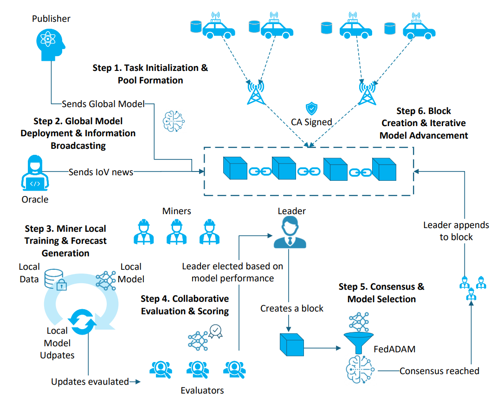
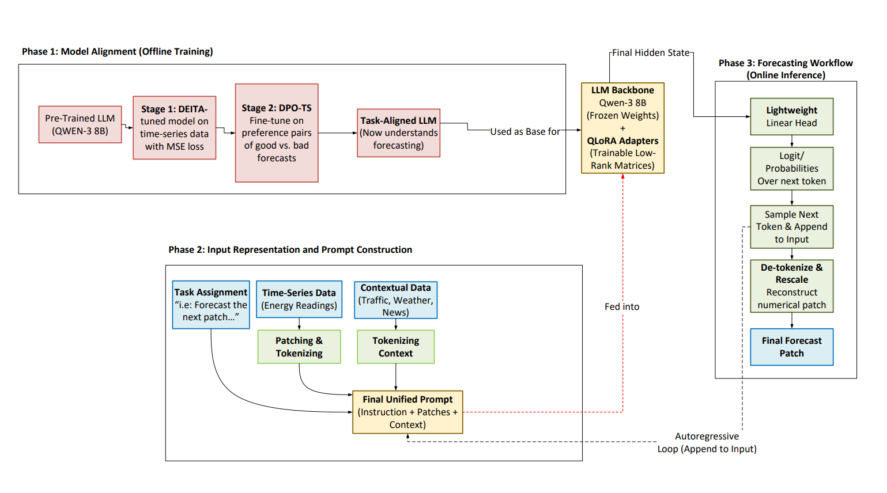
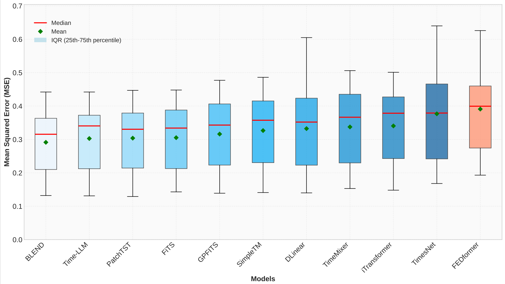
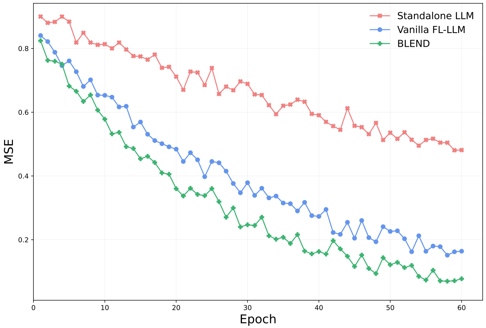
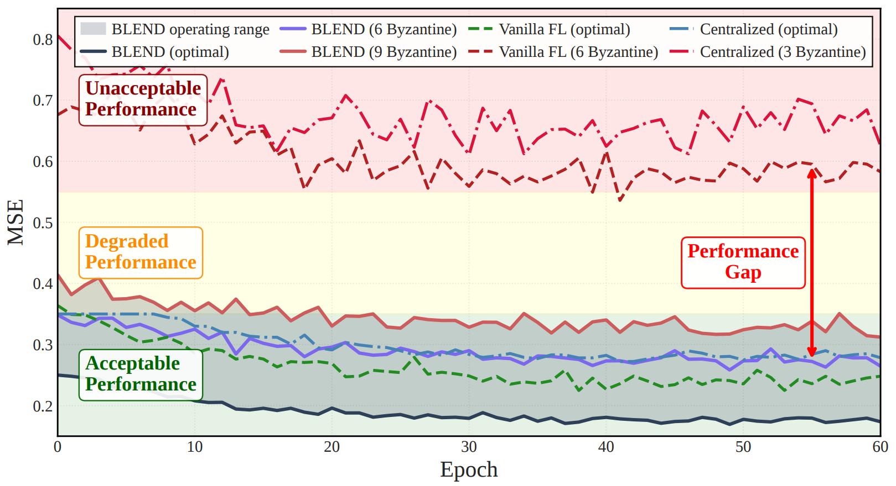
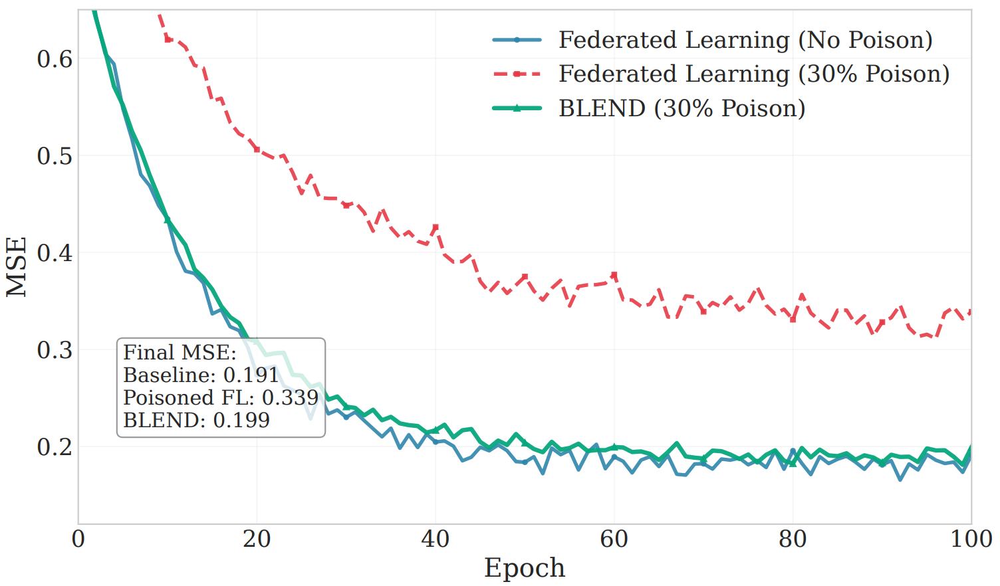
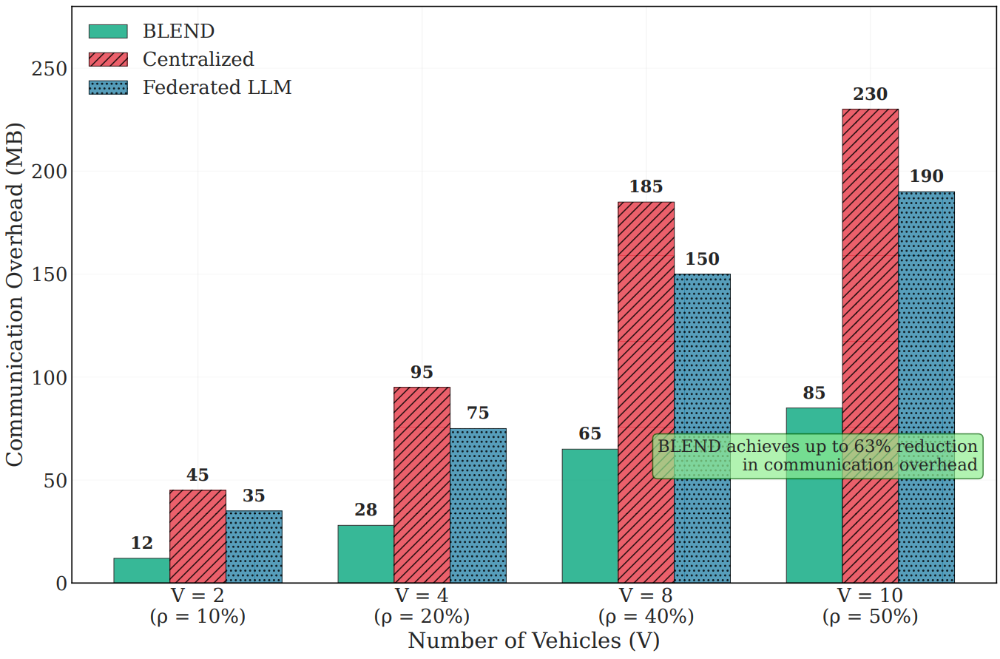
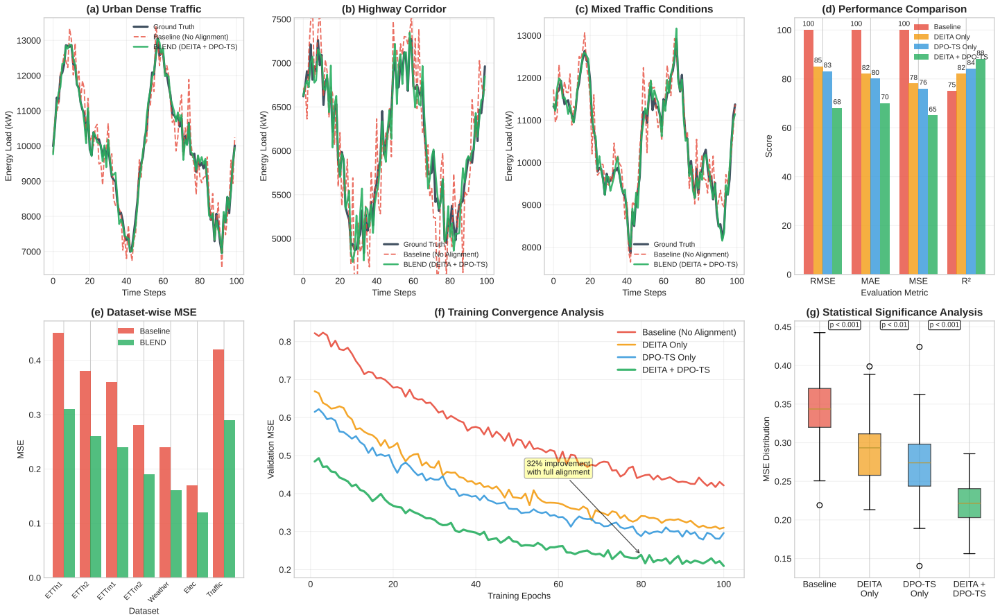
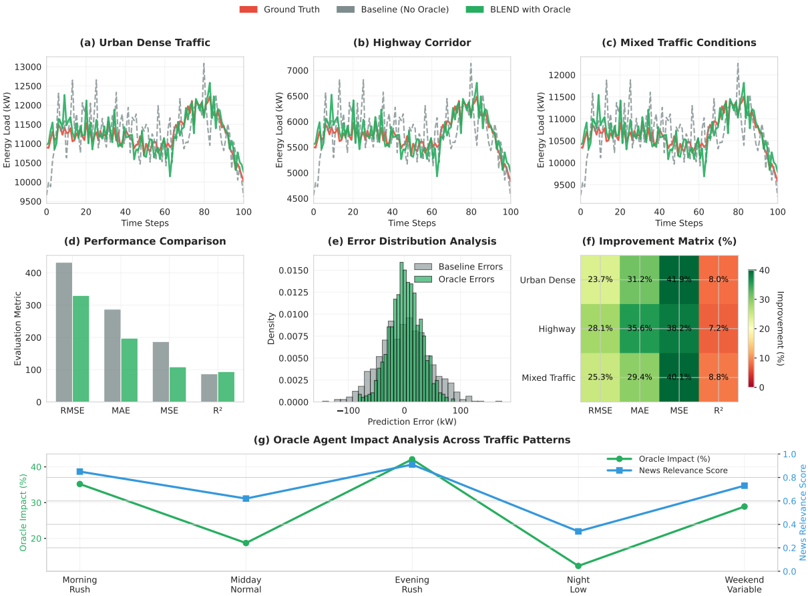

# BLEND: Blockchain-Enhanced Network Decentralisation with Large Language Models for Long-Horizon Time-Series Forecasting

[](https://www.python.org/downloads/release/python-380/)
[](https://pytorch.org/)
[](https://opensource.org/licenses/MIT)

**Author:** [Raed Abdel-Sater](mailto:raed.abdelsater@mail.concordia.ca)  
**Supervisor:** [Prof. A. Ben Hamza](mailto:hamza@concordia.ca)  
**Institution:** Concordia Institute for Information Systems Engineering, Concordia University, Montreal, QC, Canada

## Abstract

This repository contains the official implementation of **BLEND**, a novel framework that advances distributed intelligence through the synergy of blockchain technology and Large Language Models (LLMs) for long-horizon time-series forecasting in Internet of Vehicles (IoV) environments.

BLEND addresses the architectural limitations of conventional federated learning by introducing:
- **Decentralized Agentic Workflow**: Eliminates single points of failure through blockchain-orchestrated agent roles
- **Proof-of-Forecast (PoF) Consensus**: Performance-driven consensus mechanism based on predictive accuracy  
- **Task-Aligned LLM**: Specialized forecasting model using DEITA and DPO optimization
- **Communication Efficiency**: Up to 63% reduction in network overhead compared to traditional FL

## Key Features

### Architecture Innovations
- **Multi-Agent System**: Publisher, Oracle, Miner, Evaluator, and Leader agents with distinct specialized roles
- **Consortium Blockchain**: Hyperledger Fabric-based immutable ledger for model updates
- **Smart Contract Governance**: Automated incentive mechanisms and consensus protocols
- **QLoRA Integration**: Parameter-efficient fine-tuning for edge deployment

### Performance Achievements
- **Superior Accuracy**: Best or second-best performance in 12/14 metric categories across benchmarks
- **Robust Consensus**: Byzantine fault tolerance up to 33% malicious nodes
- **Efficient Training**: 32-38% faster convergence compared to vanilla federated learning
- **Scalable Communication**: Constant overhead regardless of participant count

## Experimental Results

### System Architecture and Training Workflow

BLEND implements a sophisticated six-step training workflow orchestrated by specialized agents:

<div align="center">

<br>
<em><strong>Figure 1:</strong> BLEND training round workflow showing the six-step process: (1) Task initialization and pool formation, (2) Global model deployment and information broadcasting, (3) Miner local training and forecast generation, (4) Collaborative evaluation and scoring, (5) Consensus and model selection, (6) Block creation and iterative model advancement.</em>
</div>

### LLM Forecasting Architecture

Our task-aligned LLM architecture combines offline model alignment with online inference:

<div align="center">

<br>
<em><strong>Figure 2:</strong> Three-phase BLEND architecture: Phase 1 performs offline model alignment using DEITA and DPO-TS, Phase 2 constructs unified prompts from time-series and contextual data, Phase 3 generates forecasts through autoregressive inference with QLoRA adapters.</em>
</div>

### Forecasting Performance Analysis

Our comprehensive evaluation demonstrates BLEND's superior performance across multiple datasets and baselines:

<div align="center">

<br>
<em><strong>Figure 3:</strong> Cross-dataset error distribution comparison. BLEND achieves the lowest median MSE (≈0.30) with the tightest interquartile range, demonstrating both superior accuracy and exceptional consistency across all benchmark datasets compared to transformer-based, LLM-based, and linear baselines.</em>
</div>

**Key Performance Highlights:**
- **Best or 2nd-best performance** in 12 out of 14 metric categories (85.7%)
- **Lowest median MSE** across all evaluated models
- **Exceptional consistency** with minimal variance in predictions

**Dataset-Specific Results:**
- **ETTh1**: MSE 0.406 (Best), MAE 0.422 (Best)
- **ETTh2**: MSE 0.325 (2nd Best), MAE 0.379 (2nd Best)  
- **ETTm1**: MSE 0.327 (Best), MAE 0.371 (Best)
- **ETTm2**: MSE 0.247 (Best), MAE 0.309 (Best)
- **Weather** (21 features): MSE 0.217 (Best), MAE 0.250 (Best)
- **Electricity** (321 features): MSE 0.155 (Best), MAE 0.251 (Best)
- **Traffic** (862 features): MSE 0.387 (Best), MAE 0.271 (2nd Best)

### Training Efficiency Comparison

BLEND demonstrates superior convergence characteristics compared to traditional approaches:

<div align="center">

<br>
<em><strong>Figure 4:</strong> Convergence trajectories comparing centralized LLM, vanilla federated LLM, and BLEND over 60 training epochs. BLEND converges fastest to the lowest error (0.08) with superior stability, outperforming vanilla FL (0.17) by 53% and standalone training (0.49) by 84%.</em>
</div>

**Training Efficiency Results:**
- **53% faster convergence** compared to vanilla federated learning
- **84% improvement** over standalone centralized training
- **Enhanced stability** through tamper-resilient consensus filtering

### System Resilience Under Adversarial Conditions

BLEND maintains robust performance even under significant Byzantine attacks:

<div align="center">

<br>
<em><strong>Figure 5:</strong> Byzantine fault tolerance evaluation showing BLEND's resilience under varying concentrations of malicious nodes. BLEND maintains acceptable performance even with 20% Byzantine nodes (9 out of 50), demonstrating superior robustness compared to centralized and vanilla federated approaches.</em>
</div>

**Resilience Characteristics:**
- **Acceptable performance** maintained with up to 20% Byzantine nodes
- **Graceful degradation** under adversarial conditions
- **Superior Byzantine tolerance** compared to traditional FL approaches

### Data Poisoning Attack Resilience

BLEND's consensus mechanism provides strong protection against data poisoning attacks:

<div align="center">

<br>
<em><strong>Figure 6:</strong> MSE performance under 30% data poisoning attacks. While standard federated learning degrades significantly (0.167 → 0.324 MSE), BLEND maintains near-optimal performance (0.199 MSE), achieving 35% relative recovery through consensus-driven filtering.</em>
</div>

**Poisoning Attack Results:**
- **35% relative recovery** compared to poisoned federated learning
- **Minimal performance degradation** under 30% data poisoning
- **Robust consensus filtering** effectively mitigates malicious updates

### Communication Efficiency Analysis

BLEND achieves significant communication overhead reduction through blockchain-enhanced coordination:

<div align="center">

<br>
<em><strong>Figure 7:</strong> Communication overhead comparison across different network sizes. BLEND achieves up to 63% reduction in data transfer compared to traditional approaches, with nearly constant overhead regardless of network size due to efficient blockchain propagation.</em>
</div>

**Communication Efficiency Results:**
- **Up to 63% reduction** in communication overhead
- **Constant overhead** independent of network size
- **Scalable architecture** suitable for large IoV deployments

### Ablation Study Results

Comprehensive ablation analysis demonstrates the contribution of each BLEND component:

<div align="center">

<br>
<em><strong>Figure 8:</strong> Multi-dimensional ablation study showing: (a-c) Forecasting trajectories across traffic scenarios, (d) Performance improvements with each component, (e) Dataset-wise MSE comparison, (f) Training convergence analysis, (g) Statistical significance analysis with p-values. The complete BLEND system achieves 32-38% performance gains over baseline.</em>
</div>

**Component Contributions:**
- **DEITA Alignment**: 15-18% improvement in RMSE, MAE, MSE
- **DPO-TS Optimization**: 17-20% independent improvement
- **Oracle Agent**: Consistent performance gains across all datasets
- **Combined System**: 32-38% total improvement with statistical significance (p < 0.001)

### Oracle Agent Impact Analysis

The Oracle agent provides significant performance improvements through context-aware information:

<div align="center">

<br>
<em><strong>Figure 9:</strong> Oracle agent impact analysis showing: (a-c) Forecasting performance across traffic scenarios, (d) Metric-wise improvements, (e) Error distribution analysis, (f) Improvement matrix across conditions, (g) Oracle impact correlation with news relevance scores across different traffic patterns.</em>
</div>

**Oracle Agent Results:**
- **26.0% average reduction** in RMSE
- **32.1% average reduction** in MAE  
- **40.1% average reduction** in MSE
- **Strong correlation (κ = 0.91)** between news relevance and performance gains

## Repository Structure

```
BLEND/
├── README.md
├── requirements.txt
├── setup.py
├── LICENSE
├── .gitignore
│
├── blend/                          # Core framework implementation
│   ├── __init__.py
│   ├── agents/                     # Multi-agent system
│   │   ├── __init__.py
│   │   ├── publisher.py           # Publisher agent implementation
│   │   ├── oracle.py              # Oracle agent for context data
│   │   ├── miner.py               # Miner agent for local training
│   │   ├── evaluator.py           # Model evaluation agent
│   │   └── leader.py              # Leader agent for aggregation
│   │
│   ├── blockchain/                 # Blockchain infrastructure
│   │   ├── __init__.py
│   │   ├── consensus.py           # Proof-of-Forecast protocol
│   │   ├── smart_contracts.py     # Contract implementations
│   │   ├── block.py               # Block structure definitions
│   │   └── fabric_client.py       # Hyperledger Fabric interface
│   │
│   ├── models/                     # LLM forecasting models
│   │   ├── __init__.py
│   │   ├── task_aligned_llm.py    # DEITA+DPO aligned model
│   │   ├── qlora_adapter.py       # QLoRA implementation
│   │   ├── patch_embedding.py     # PatchTST-style tokenization
│   │   └── forecasting_head.py    # Prediction head module
│   │
│   ├── federated/                  # Federated learning components
│   │   ├── __init__.py
│   │   ├── fed_adam.py            # FedADAM optimization
│   │   ├── aggregation.py         # Model aggregation logic
│   │   └── communication.py       # Peer-to-peer communication
│   │
│   ├── incentives/                 # Reward and staking mechanisms
│   │   ├── __init__.py
│   │   ├── reward_system.py       # Multi-component rewards
│   │   ├── stake_dynamics.py      # Stake management
│   │   └── evaluation_scoring.py  # Performance scoring
│   │
│   └── utils/                      # Utility functions
│       ├── __init__.py
│       ├── data_loader.py         # Dataset preprocessing
│       ├── metrics.py             # Evaluation metrics
│       ├── visualization.py       # Result plotting
│       └── config.py              # Configuration management
│
├── scripts/                        # Execution scripts
│   ├── train_blend.py             # Main training script
│   ├── run_experiments.py         # Benchmark evaluation
│   ├── setup_blockchain.py        # Blockchain initialization
│   ├── ablation_study.py          # Component ablation
│   └── generate_results.py        # Result generation
│
├── configs/                        # Configuration files
│   ├── default.yaml               # Default parameters
│   ├── datasets/                  # Dataset-specific configs
│   │   ├── ett.yaml
│   │   ├── weather.yaml
│   │   ├── electricity.yaml
│   │   └── traffic.yaml
│   └── models/                    # Model configurations
│       ├── qwen_3_8b.yaml
│       └── qlora_config.yaml
│
├── data/                          # Dataset directory
│   ├── raw/                       # Raw dataset files
│   ├── processed/                 # Preprocessed data
│   └── splits/                    # Train/val/test splits
│
├── experiments/                   # Experimental results
│   ├── benchmarks/                # Benchmark comparisons
│   ├── ablation/                  # Ablation study results
│   ├── resilience/                # Byzantine fault tolerance
│   └── communication/             # Overhead analysis
│
├── docs/                          # Documentation
│   ├── architecture.md            # System architecture
│   ├── consensus_protocol.md      # PoF consensus details
│   ├── api_reference.md           # API documentation
│   └── deployment_guide.md        # Deployment instructions
│
└── tests/                         # Test suite
    ├── unit/                      # Unit tests
    ├── integration/               # Integration tests
    └── system/                    # End-to-end system tests
```

This comprehensive project structure provides a robust foundation for the BLEND framework, enabling research reproducibility, easy deployment, and future extensions while maintaining code quality and documentation standards.

## Quick Start

## Quick Start

### Basic Usage

```python
from blend import BLENDFramework
from blend.agents import Publisher, Oracle, Miner, Evaluator, Leader
from blend.models import TaskAlignedLLM

# Initialize BLEND framework
framework = BLENDFramework(
    model_name="qwen-3-8b",
    blockchain_config="configs/blockchain.yaml",
    dataset="ETTh1"
)

# Setup multi-agent system
agents = framework.setup_agents(
    num_miners=10,
    num_evaluators=3,
    consensus_threshold=0.67
)

# Train with blockchain consensus
results = framework.train(
    epochs=200,
    local_epochs=3,
    learning_rate=1e-3,
    consensus_protocol="proof_of_forecast"
)
```

## Installation

### Prerequisites

```bash
# Python environment
python >= 3.8
pytorch >= 2.0.0
transformers >= 4.30.0
hyperledger-fabric >= 2.4
```

### Quick Install

```bash
# Clone repository
git clone https://github.com/yourusername/BLEND.git
cd BLEND

# Install dependencies
pip install -r requirements.txt

# Install BLEND package
pip install -e .
```

### Advanced Installation

For development or custom configurations:

```bash
# Create virtual environment
python -m venv blend_env
source blend_env/bin/activate  # Linux/Mac
# or
blend_env\Scripts\activate     # Windows

# Install with all optional dependencies
pip install -e ".[all]"
```

### Docker Installation

```bash
# Build Docker container
docker build -t blend:latest .

# Run with Docker Compose
docker-compose up -d
```

### System Efficiency

**Communication Overhead Reduction:**
- 2 vehicles (ρ=10%): 63% reduction vs centralized
- 10 vehicles (ρ=50%): 58% reduction vs federated LLM

**Training Convergence:**
- 32% faster convergence compared to vanilla FL
- 84% improvement over standalone training
- Stable performance under Byzantine conditions

### Resilience Evaluation

**Byzantine Fault Tolerance:**
- Maintains acceptable performance with up to 20% Byzantine nodes
- Graceful degradation under adversarial conditions
- Superior robustness compared to centralized and vanilla FL

## Methodology

### Multi-Agent Architecture

**Agent Roles:**
1. **Publisher (P)**: Task initialization and global model deployment
2. **Oracle (O)**: Context-aware data aggregation from external sources
3. **Miners (M₁...Mₙ)**: Local model training and proposal generation  
4. **Evaluators (E)**: Model validation and scoring
5. **Leader (L)**: Consensus facilitation and block creation

### Proof-of-Forecast Consensus

The novel PoF protocol ensures model quality through:
- Performance-based leader election
- Byzantine fault tolerant voting (>2/3 majority)
- Stake-weighted participation incentives
- Tamper-resistant audit trails

### Task-Aligned LLM Training

**Two-Stage Alignment Process:**
1. **DEITA (Data-Efficient Instruction Tuning)**: MSE-optimized supervised fine-tuning
2. **DPO-TS (Direct Preference Optimization for Time Series)**: Preference-based refinement

**Parameter-Efficient Training:**
- QLoRA with rank r=16, scaling factor α=32
- 4-bit quantization for edge deployment
- Frozen backbone with trainable adapters

## Benchmarks and Baselines

### Evaluated Models
- **Transformer-based**: PatchTST, iTransformer, FEDformer
- **LLM-based**: GPT4TS, Time-LLM  
- **Linear/MLP**: DLinear, TimeMixer, SimpleTM
- **Federated**: Fed-PatchTST, FSLSTM, FedTime

### Datasets
- **ETT Series**: ETTh1, ETTh2, ETTm1, ETTm2 (Electricity Transformer Temperature)
- **Weather**: 21 meteorological features, 10-minute intervals
- **Electricity**: 321 household power consumption readings
- **Traffic**: 862 San Francisco Bay Area freeway segments

## Citation

If you use BLEND in your research, please cite our paper:

```bibtex
@article{abdelsater2025blend,
  title={BLEND: Blockchain-Enhanced Network Decentralisation with Large Language Models for Long-Horizon Time-Series Forecasting},
  author={Abdel-Sater, Raed and Hamza, A. Ben},
  journal={arXiv preprint arXiv:2025.xxxxx},
  year={2025},
  institution={Concordia Institute for Information Systems Engineering, Concordia University}
}
```

## Contributing

We welcome contributions! Please see our [Contributing Guidelines](CONTRIBUTING.md) for details.

### Development Setup

```bash
# Install development dependencies
pip install -r requirements-dev.txt

# Run tests
pytest tests/

# Code formatting
black blend/
isort blend/

# Type checking
mypy blend/
```

## License

This project is licensed under the MIT License - see the [LICENSE](LICENSE) file for details.

## Acknowledgments

- Concordia Institute for Information Systems Engineering
- Hyperledger Fabric community
- Hugging Face Transformers library
- PyTorch Lightning framework

## Contact

For questions and collaborations:
- **Author**: [Raed Abdel-Sater](mailto:raed.abdelsater@mail.concordia.ca)
- **Supervisor**: [Prof. A. Ben Hamza](mailto:hamza@concordia.ca)
- **Institution**: Concordia Institute for Information Systems Engineering, Concordia University

---

**Keywords**: Federated Learning, Blockchain, Large Language Models, Time-Series Forecasting, Internet of Vehicles, Multi-Agent Systems
